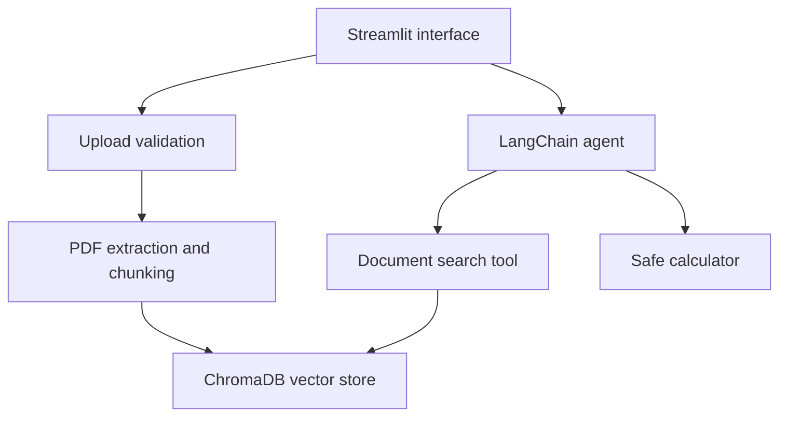

# PDF RAG Agent

An agentic Retrieval-Augmented Generation application for asking grounded
questions about PDF documents.

The application extracts and chunks PDF text, creates local embeddings, stores
them in ChromaDB, and gives a Claude-powered LangChain agent tools for semantic
search and safe arithmetic. Answers are grounded in retrieved document content
and include document and page references.

## Features

- Upload and index PDF documents through Streamlit
- Extract PDF text while preserving page metadata
- Split documents into overlapping semantic-search chunks
- Generate local embeddings with `all-MiniLM-L6-v2`
- Persist vectors locally with ChromaDB
- Restrict retrieval to the active document
- Optionally search across all indexed documents
- Detect duplicate uploads using SHA-256 document identifiers
- Filter weak retrieval results using vector distance
- Maintain chat history within the Streamlit session
- Perform arithmetic through a restricted AST-based calculator
- Cite retrieved document names and page numbers
- Defend against instructions embedded inside untrusted documents
- Run deterministic tests without paid API requests

## Architecture



## Project structure

```text
pdf-rag-agent/
├── .github/workflows/tests.yml
├── .streamlit/config.toml
├── scripts/
│   └── manual_search.py
├── src/pdf_rag_agent/
│   ├── __init__.py
│   ├── agent.py
│   ├── app.py
│   ├── arithmetic.py
│   ├── config.py
│   ├── ingest.py
│   ├── tools.py
│   └── uploads.py
├── tests/
├── .env.example
├── .gitignore
├── pyproject.toml
└── uv.lock
```

## How it works

1. A PDF upload is validated for file type, size, and PDF signature.
2. The file content is hashed to create a stable document identifier.
3. Text is extracted page by page with PyPDF.
4. Text is divided into overlapping chunks.
5. Chunk embeddings are stored in a persistent ChromaDB collection.
6. The agent searches either the active PDF or the complete index.
7. Retrieved chunks are filtered using vector distance.
8. Claude answers using the retrieved evidence and cites its source pages.
9. Arithmetic questions are delegated to a restricted calculator tool.

## Requirements

- Python 3.12
- [uv](https://docs.astral.sh/uv/)
- An Anthropic API key
- Internet access during the initial embedding-model download

## Installation

Clone the repository:

```powershell
git clone https://github.com/Melusi-M/pdf-rag-agent.git
cd pdf-rag-agent
```

Install the locked dependencies:

```powershell
uv sync --locked --dev
```

Create your local environment file:

```powershell
Copy-Item .env.example .env
```

Update `.env` with your credentials and supported model:

```dotenv
ANTHROPIC_API_KEY=replace-with-your-api-key
CLAUDE_MODEL=replace-with-a-supported-model
```

Never commit the populated `.env` file.

## Running the application

```powershell
uv run streamlit run .\src\pdf_rag_agent\app.py
```

Then:

1. Upload a PDF.
2. Select **Process PDF**.
3. Ask questions about the active document.
4. Enable **Search all indexed documents** when cross-document retrieval is
   required.

Uploaded PDFs and the local ChromaDB index are deliberately excluded from Git.

## Manual retrieval test

To inspect raw semantic-search results without invoking Claude:

```powershell
uv run python .\scripts\manual_search.py
```

## Running tests

```powershell
uv run pytest -v
```

Tests use fakes and mocks where appropriate and do not make paid Anthropic API
requests.

GitHub Actions also runs the test suite for pushes and pull requests targeting
`main`.

## Security and privacy

- API credentials are loaded from `.env`, which is ignored by Git.
- Uploaded PDFs are stored only in the ignored local `data/` directory.
- ChromaDB data is stored only in the ignored local `chroma_db/` directory.
- PDF files are excluded from Git by default.
- Upload filenames are sanitized before storage.
- File content is validated before ingestion.
- Arithmetic expressions are parsed with Python's AST rather than `eval`.
- Retrieved document text is treated as untrusted data, not agent instructions.

This project is intended as a learning and portfolio project. Do not use its
answers as legal, financial, medical, or other professional advice.

## Known limitations

- Image-only and scanned PDFs require OCR, which is not currently implemented.
- Retrieval quality depends on the embedding model, chunking strategy, and
  document extraction quality.
- ChromaDB is local and does not provide multi-user isolation.
- Conversation history lasts only for the current Streamlit session.
- Uploaded documents cannot yet be managed or deleted through the interface.
- Answer quality still depends on the configured Claude model.

## Roadmap

- Add OCR support for scanned documents
- Add document listing and deletion
- Add automated retrieval-quality evaluations
- Add reranking for improved retrieval precision
- Add streaming model responses
- Add configurable collection and embedding settings

## License

This project is licensed under the MIT License.